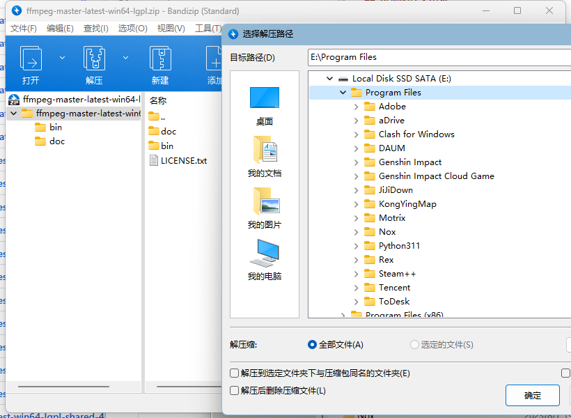
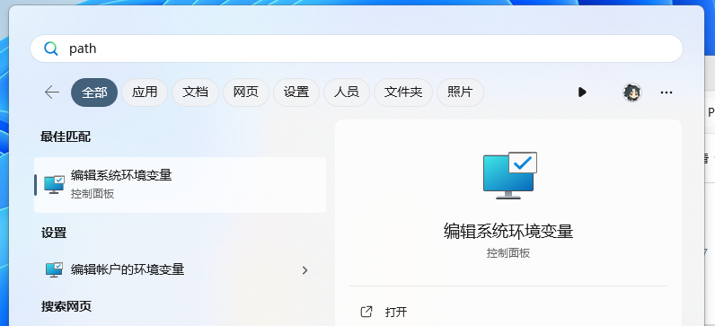
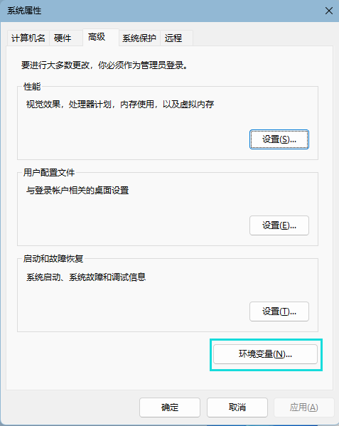
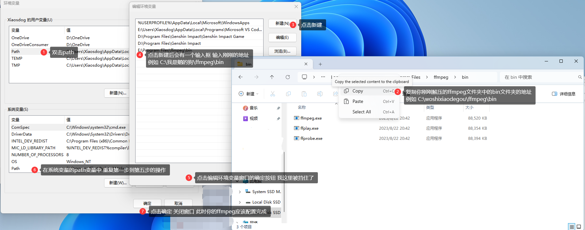

# Genshin Impacct Auto Launch


## 声明

forked from
[YinBuLiao/GenshinImpact_Start](https://github.com/YinBuLiao/GenshinImpact_Start)
十分感谢 我只是添加了可配置性

从 [config.ini](.\config.ini) 文件进行设置 满足大多数原神,启动！要求

## 警告
<font color="red">**程序最开始打开是需要一段时间的 请耐心等待。</br>如果需要播放振奋人心的启动音乐，您需要自己安装ffmpeg且确保在环境变量内，才能正确播放音频，否则可能无法播放音频。** </br>最好先单独运行musicplayer.exe一次 否则启动时musicplayer.exe会自解压自己的运行文件 造成播放大延迟 记得根据你的原神启动速度调整 musicDelay 值</font></br>
贴心FFmpeg安装的我已经写好教程啦 翻到底部即可查看

## 构建
### (此内容不包含在下载后的程序包中)
1. **在程序根目录以管理员身份打开 `cmd.exe` 或 `Power shell` 输入以下命令:
   `pip install -r install_requirements.py`\
   如果它正确安装了所有的包 且没有报错可继续执行下一步**\
   如果没有 请手动继续输入\
   `cd .\RunningFiles\`
   然后在文件资源管理器中打开 `pip-packages.txt` 依次输入
   `pip install` + 文本文档中的每一行
2. 编辑完代码后 在 main.py 所在目录以管理员身份打开 `cmd.exe` 或 `Power shell` 输入以下命令:\
   `pyinstaller main.py --icon=favicon.ico`\
   *打包main.py为main.exe 且main.exe图标为当前目录所在的favicon.ico图片文件*\
   如果你想让它单独为一个exe文件 可以使用以下方法:\
   `pyinstaller --onefile main.py --upx-dir="你的当前所在目录" --icon=favicon.ico`\
   *打包main.py为main.exe 但是不会生成很多文件 且使用upx压缩exe文件*
## 可配置文件

``` ini
[launch]
readshortcut = false # 是否从桌面读取快捷方式来启动原神
gamelocation = YuanShen.exe # 如果不读取桌面快捷方式 请输入YuanShen.exe的绝对路径 不需要加入引号
[check]
scaningscreendelay = 3 # 间隔扫描时间 单位: 秒 这样做应该可以节约功耗
launchwhitepercentage = 90 # 如果白色率大于等于这个值 将自动启动白色率可能大于100 先测试一下 调整到舒适值
[music]
playlaunchmusic = true # 是否在原神，启动！时后台播放启动音乐, 默认有两种可供选择
musicdelay = 3 # 设置歌曲延迟(秒)，可能播放的时候没有对接上
launchmusicstyle = 3 # 选择音乐类型 1 为 Shed A Light(启动の小曲) 2 为 门酱DDD 的 “原神，启动！！！” 3 为 两者合一 你也可以在 RunningFiles\Music\ 中添加更多mp3
```

## 添加的技术内容
- **pyparaser** 读取配置文件
- **pydub** 播放音乐模块
- **threading** 多线程播放
<br/>
### 如何下载ffmpeg且添加到环境变量中?
首先 从[BtbN/FFmpeg-Builds](https://github.com/BtbN/FFmpeg-Builds/releases/tag/latest)**中下载 ffmpeg-master-latest-win64-lgpl.zip 文件**然后解压到合适的位置**



接着 按下 Windows 键 依次输入 p a t h 四个字母 打开环境变量配置



在新窗口中 点击右下角的 环境变量 按钮



请按照图片操作 如果需要放大 尝试 Ctrl + 鼠标滚轮 或者在项目 FFMpegInstallHelp 文件夹中打开image.png



测试: 按下 Win 键 + R 输入 `cmd` 点击确定

在弹出的窗口中 输入以下命令

`ffmpeg`

如果有一大串英文 说明安装成功